# Instagram Thrift Creator Store - Database Design

Database design (ER diagram) for a small Instagram-based business that sells thrifted fashion items and handmade products, managing customers, orders, payments, and shipping.

For the full problem statement, see [PROBLEM.md](PROBLEM.md).

## ER Diagram

## Entities

| Entity | Purpose |
|---|---|
| **customer** | Buyer info -- name, phone, email, Instagram handle, address |
| **product** | Catalog of items -- type (thrifted/handmade), price, size, color, condition, stock |
| **order_record** | A purchase event linked to a customer |
| **order_item** | Junction table linking orders to products (resolves many-to-many) |
| **payment** | Payment method, status, amount, and transaction reference for an order |
| **shipment** | Shipping address, method, status, and tracking for an order |

## Key Design Decisions

- **Single product table** with a `product_type` column instead of separate tables for thrifted and handmade items.
- **Condition is nullable** -- only relevant for thrifted items, left NULL for handmade.
- **Unit price in order_item** snapshots the price at purchase time so historical orders stay accurate.
- **Shipping address stored on shipment**, not just on customer, because delivery address can differ per order.
- **order_record used instead of order** to avoid SQL reserved keyword conflicts.
- **order_item as junction table** properly resolves the many-to-many relationship between orders and products.

## Relationships

- One customer can place many orders.
- One order can contain many products (via order_item).
- One product can appear in many orders (via order_item).
- One order has one payment.
- One order has one shipment.

## Tools Used

- [Mermaid](https://mermaid.js.org/) for ER diagram generation
